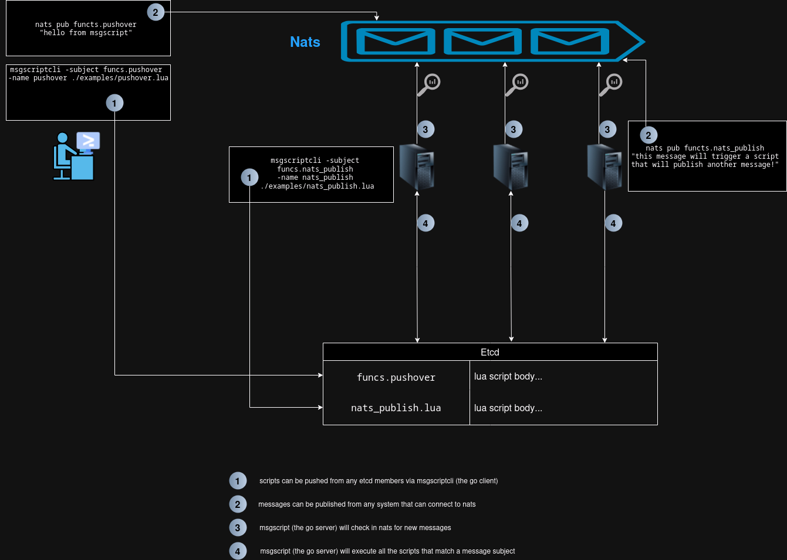

<p align="center">
  
</p>

<!-- markdown-toc start - Don't edit this section. Run M-x markdown-toc-refresh-toc -->
**Table of Contents**

- [Features](#features)
- [How it works](#how-it-works)
    - [HTTP handler](#http-handler)
- [Installation](#installation)
    - [Outside NixOS](#outside-nixos)
- [Dependencies](#dependencies)
- [Usage](#usage)
    - [Adding Scripts](#adding-scripts)
    - [Writing Lua Scripts](#writing-lua-scripts)
    - [Plugin system](#plugin-system)
    - [Libraries](#libraries)
- [Contributing](#contributing)
- [Support](#support)

<!-- markdown-toc end -->

TLDR: msgscript is primarily a Go server that runs Lua functions based on NATS subjects.

## Features

- Single binary
- Nearly no overheads
- Good enough performances (RTT of around 10ms for the hello example)
- Runs Lua functions based on NATS subjects
- Integrates with etcd for script storage
- Can use libraries
- Can add Go based plugins exposed to the lua functions
- HTTP handler to push messages to NATS

## How it works

<p align="center">
  <a href="how_it_works.png">
    
  </a>
</p>

The above [picture](how_it_works.png) explains what happens when a message is sent and the server sees a match and than executes a script. It's important to note that there can be more than one script attached to a subject. This is why you'll the CLI ask for a name for a script.

### HTTP handler

If you have a application that cannot reach nats by itself (say a webhook), it's possible to use the included HTTP handler.

The server listens to port 7643 by default. You can push messages by doing a POST request to `http://serverIP:7643/<subject>` where the `<subject>` is any subjects that you have scripts registered to it.

Example using curl (for localhost):

```
curl -X POST http://localhost:7643/funcs.pushover
```

## Installation

msgscript is primarily designed to be used with Nix and NixOS (this is my personal use case). You can enable it in your NixOS configuration using the provided module (once included from either the flake or importing the module using something like `niv` or manually):

```nix
services.msgscript.enable = true;
```

 The options are defined in the [nix/modules/default.nix](nix/modules/default.nix) file.
 
### Outside NixOS
 
While I don't deploy it myself, this isn't to say that it's not possible to use msgscript outside of NixOS. Currently you'll have to build and run the server yourself.

Being a standalone Go binary, you can build each of the binaries like so:
 ```sh
 go build ./cmd/server # Generates the server binary
 go build ./cmd/cli    # Generates the CLI binary
 ```

## Dependencies

The server requires:
- etcd
- NATS

Ensure these services are running and accessible to the msgscript server. The server and CLI can see the `NATS_URL` and `ETCD_ENDPOINTS` environment variables on top of the flags `-etcdurl` and `-natsurl`.

## Usage

### Adding Scripts

You can add Lua scripts to etcd using the `msgscriptcli` command. Here's an example:

```bash
msgscriptcli add -subject funcs.pushover -name pushover ./examples/pushover.lua
```

This command adds the `pushover.lua` script from the `examples` directory, associating it with the subject `funcs.pushover` and the name `pushover`.

### Writing Lua Scripts

When writing Lua scripts for msgscript, you have access to additional modules:

- `etcd`: Read/Write/Update/Delete keys in etcd [source](lua/etcd.go)
- `http`: For making HTTP requests [source](https://github.com/cjoudrey/gluahttp)
- `json`: For JSON parsing and generation [source](https://github.com/layeh/gopher-json)
- `lfs`: LuaFilesystem implementation [source](https://layeh.com/gopher-lfs)
- `nats`: For publishing messages back to NATS [source](lua/nats.go)
- `re`: Regular expression library [source](https://github.com/yuin/gluare)

Some examples scripts are provided in the `examples` folder.

### Plugin system

While there is already a lot of modules added to the Lua execution environment, it is possible to add more using the included plugin system.

An example [plugin](plugins/hello/main.go) is available. The plugins can be loaded using the `--plugin` flag for both the server and cli.

Plugins currently included in this repository:

* `scrape`: An http parser [source](https://github.com/felipejfc/gluahttpscrape)
* `db`: SQL access to MySQL, Sqlite3 and PostgreSQL [source](https://github.com/tengattack/gluasql)
* Various modules from the [gopher-lua-libs](https://github.com/vadv/gopher-lua-libs):
    * `cmd`
    * `filepath`
    * `inspect`
    * `ioutil`
    * `runtime`
    * `strings`
    * `time`

### Libraries

Libraries are lua files that gets prepended to the script that needs to be run. They are added to etcd using the `lib add` command using the CLI. Once added, these libraries can be used within other scripts using the `require` header like this:

``` lua
--* require: foo
```

In this case, it will load the library named `foo` and prepend it to the running script.

An example library is available [here](examples/lib/opentrashmail.lua).

## Contributing

Contributions are welcome! Please feel free to submit a Pull Request.

## Support

If you encounter any problems or have any questions, please open an issue on the GitHub repository.
