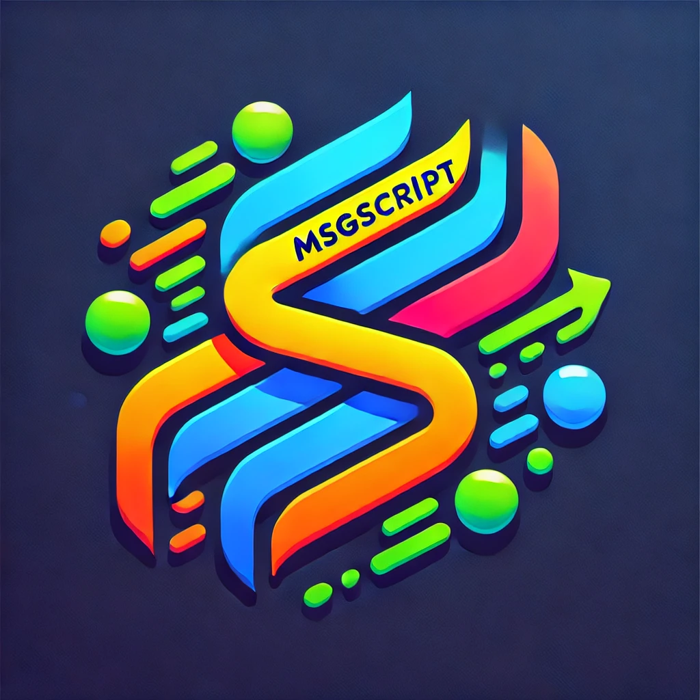

<p align="center">
  
</p>

<!-- markdown-toc start - Don't edit this section. Run M-x markdown-toc-refresh-toc -->
**Table of Contents**

- [Features](#features)
- [Installation](#installation)
    - [Outside NixOS](#outside-nixos)
- [Dependencies](#dependencies)
- [Usage](#usage)
    - [Adding Scripts](#adding-scripts)
    - [Writing Lua Scripts](#writing-lua-scripts)
- [Contributing](#contributing)
- [Support](#support)

<!-- markdown-toc end -->


msgscript is primarily a Go server that runs Lua functions internally based on NATS subjects.

## Features

- Single binary
- Nearly no overheads
- Good enough performances (RTT of around 10ms for the hello example)
- Runs Lua functions based on NATS subjects
- Integrates with etcd for script storage

## Installation

msgscript is primarily designed to be used with Nix and NixOS (this is my personal use case). You can enable it in your NixOS configuration using the provided module:

```nix
services.msgscript.enable = true;
```

 The options are defined in the `nix/modules/default.nix` file.
 
### Outside NixOS
 
 Being a standalone Go binary, you can build each of the binaries like so:
 ```sh
 go build ./cmd/server # Generates the server binary
 go build ./cmd/cli    # Generates the cli binary
 ```

## Dependencies

The server requires:
- etcd
- NATS

Ensure these services are running and accessible to the msgscript server. The server and cli can see the `NATS_URL` and `ETCD_ENDPOINTS` environment variables on top of the flags `-etcdurl` and `-natsurl`.

## Usage

### Adding Scripts

You can add Lua scripts to etcd using the `msgscriptcli` command. Here's an example:

```bash
msgscriptcli -subject funcs.pushover -name pushover ./examples/pushover.lua
```

This command adds the `pushover.lua` script from the `examples` directory, associating it with the subject `funcs.pushover` and the name `pushover`.

### Writing Lua Scripts

When writing Lua scripts for msgscript, you have access to additional modules:

- `db`: SQL access to MySQL, Sqlite3 and PostgreSQL
- `http`: For making HTTP requests
- `json`: For JSON parsing and generation
- `lfs`: LuaFilesystem implementation
- `nats`: For publishing messages back to NATS
- `re`: Regular expression library
- Various modules from the [gopher-lua-libs](https://github.com/vadv/gopher-lua-libs) 

Some examples scripts are provided in the `examples` folder.

## Contributing

Contributions are welcome! Please feel free to submit a Pull Request.

## Support

If you encounter any problems or have any questions, please open an issue on the GitHub repository.
